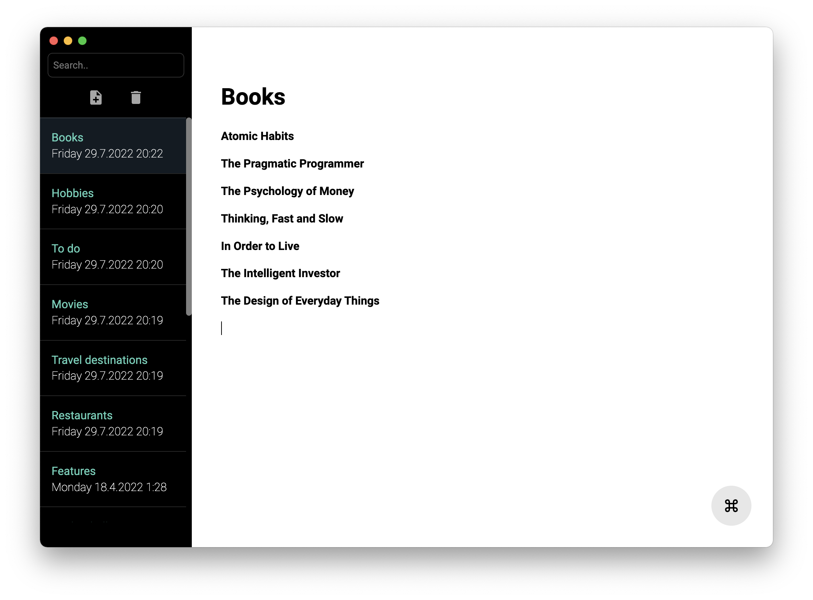

# notemkr


Simple note making desktop app build with React and Electron with rich text editing support.

*In order to use this app you also need a database and a backend app. Code for backend repo will be linked here later.* 

## Install

Clone the repo and install dependencies:

```bash
npm install
```

